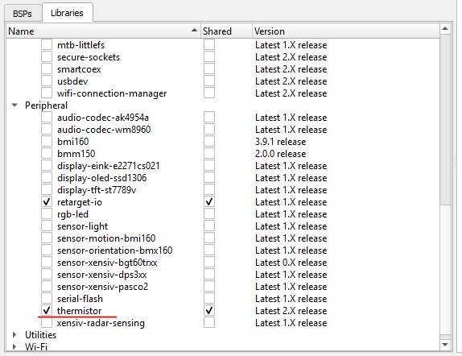

# Temperature measurement on PSoC 6 WI-FI BT Prototyping Board

For the temperature management the onboard thermistor was used. The firmware is based on the ModusToolbox project with appropriate libraries. The measurement control and logging are carried out with a python script. Communication between the python script and the board is organized through UART using `pyserial` package.

## Prerequisites

- [ModusToolbox&trade; software](https://www.cypress.com/products/modustoolbox-software-environment) v2.2
- [Python&trade; software](https://www.python.org/downloads) v3.9.2
- [Pyserial](https://pypi.org/project/pyserial) package v3.5 for Python
- [PSoC&trade; 6 WI-FI BT Prototyping Board](https://www.infineon.com/cms/en/product/evaluation-boards/cy8cproto-062-4343w) (`CY8CPROTO-062-4343W`)

## Firmware setup

1) Clone the repository.

1) Create "Hello World!" example project in ModusToolbox.

2) Replace `main.c` in the project with `thermistor/mtb/main.c` from the repository.

3) Add **thermistor** library to the project in **Library Manager**.

   
4) Build and program the firmware (ensure that the board is connected to the computer).

## Python script usage

Run `python [path to repository]/thermistor/python/main.py` in the command line with one of the following arguments:

- `--start` to launch the temperature measurement and logging.
- `--stop` to pause the measurement.
- `--set-timer [seconds]` to configure timer period in seconds.